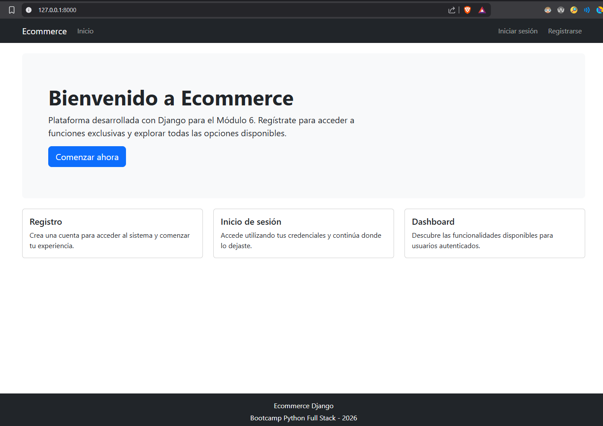
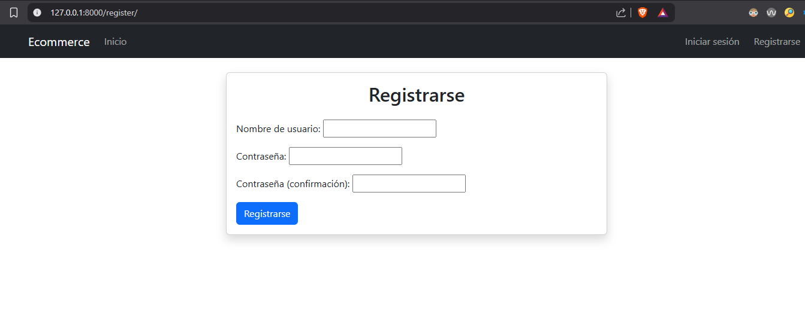
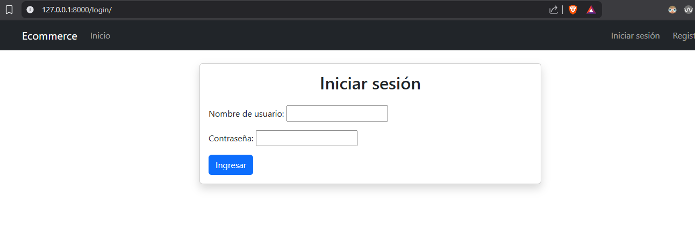
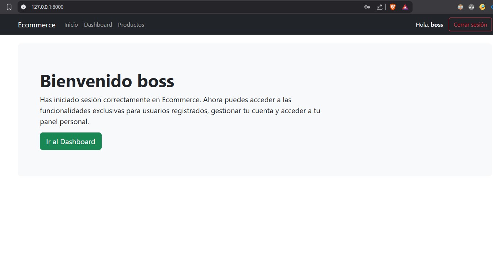
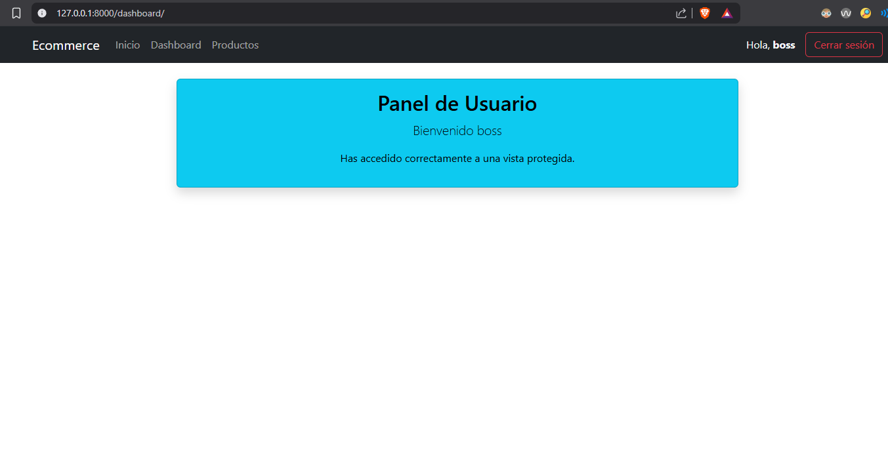
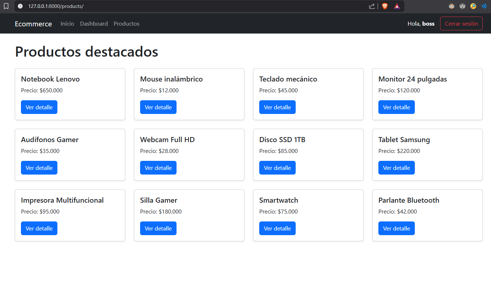
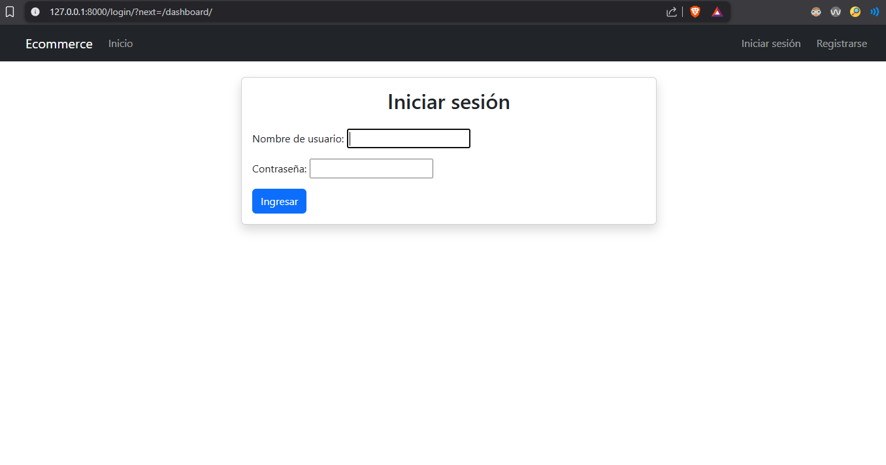
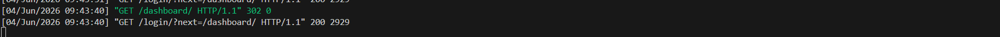

# DESARROLLO DE APLICACIONES WEB CON PYTHON DJANGO (V2)

## Tabla de contenidos
- [Fundamentos de bases de datos relacionales](#fundamentos-de-bases-de-datos-relacionales)
    - [Tabla de contenidos](#tabla-de-contenidos)
    - [Instrucciones](#instrucciones)
    - [Construido con](#construido-con)
    - [Ejecutar](#ejecutar)

    - [GitHub Repositorio](#github-repositorio)
    - [Estructura del proyecto](#estructura-del-proyecto)
    - [Autor](#Autor)

## Instrucciones 
Implementar un sistema de autenticación de usuarios en una aplicación web desarrollada con 
Django, incorporando páginas de inicio de sesión y cierre de sesión, así como vistas protegidas que 
permitan diferenciar el acceso a determinadas secciones del e-commerce.

## Construido con

* Python `3.14+`
* pip
* Visual Studio Code
* SQLite3 
* Windows 11

## Instalación y ejecución del proyecto
### Entrar a la carpeta:

```bash
cd actividad_m6_l5
```

---

### Crear entorno virtual

```bash
python -m venv venv
```

---

### Activar entorno virtual

```bash
venv\Scripts\activate
```
---

### Instalar dependencias

```bash
pip install django
```

---

### Ejecutar servidor

```bash
python manage.py runserver
```
---
### Abrir proyecto
http://127.0.0.1:8000/

---

## Rutas principales

| Ruta        | Descripción          | Requiere login|
| ----------- | -------------------- |---------------|
| /           | Página principal     |      No       |
| /register/  | Registro de usuarios |      No       |
| /login/     | Inicio de sesión     |      No       |
| /dashboard/ | Vista protegida      |      Si       |
| /products / | Vista protegida      |      Si       |

---

## Evidencia 
### Pagina principal

## Registro de usuarios

> [!NOTE]
> El formulario queda desordenado por que se utilizo
> solo el formulario predeterminado de {{ form.as_p }} en Django
## Inicio de sesion

> [!NOTE]
> El formulario queda desordenado por que se utilizo
> solo el formulario predeterminado de {{ form.as_p }} en Django
## Pagina principal luego de iniciar sesion

## DashBoard

## Productos

## Intento de entrar al `Dashboard` desde la URL sin iniciar sesion(Redirije automaticamente a `/login`)


## GitHub Repositorio

[https://github.com/JCarvajalLab/Modulo-6-E-commerce-auth-user-django](https://github.com/JCarvajalLab/Modulo-6-E-commerce-auth-user-django)

## Estructura del proyecto

```
└── 📁ecommerce
    └── 📁accounts
        └── 📁migrations
            ├── __init__.py
        ├── __init__.py
        ├── admin.py
        ├── apps.py
        ├── forms.py
        ├── models.py
        ├── tests.py
        ├── urls.py
        ├── views.py
    └── 📁ecommerce
        ├── __init__.py
        ├── asgi.py
        ├── settings.py
        ├── urls.py
        ├── wsgi.py
    └── 📁static
        └── 📁css
            ├── styles.css
        └── 📁images
    └── 📁templates
        └── 📁accounts
            ├── dashboard.html
            ├── login.html
            ├── products.html
            ├── register.html
        └── 📁components
            ├── footer.html
            ├── navbar.html
        ├── base.html
        ├── home.html
    ├── db.sqlite3
    ├── manage.py
    ├── README.md
    └── requirements.txt
```

## Autor

**Actividad Final - Modulo 6 - Desarrollo Portafolio**

**Alumno:** Jordan Carvajal - **Fecha:** 03-06-2026


